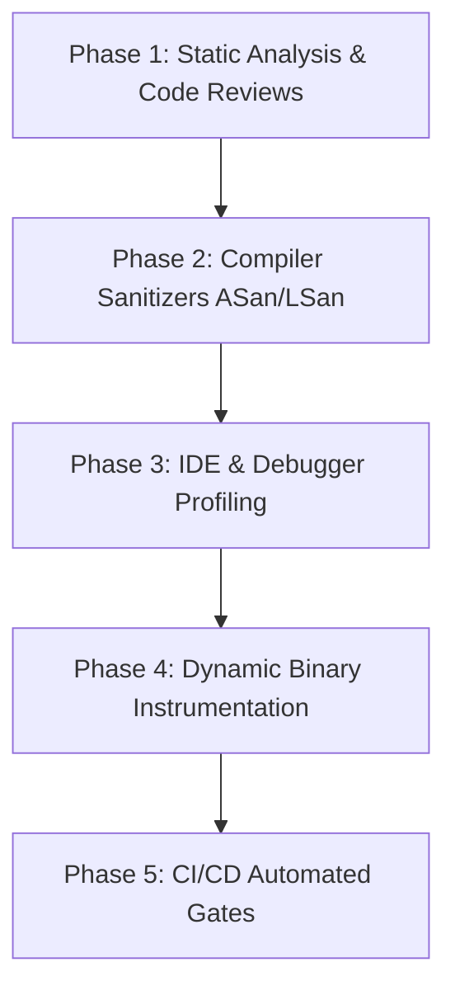

# C++ Memory Leak Detection Roadmap & Best Practices

This document outlines a structured roadmap, industry best practices, and tools recommended by Microsoft and Google for detecting, debugging, and preventing memory leaks in C++ applications.

---

## 🗺️ The Memory Leak Detection Roadmap



### Phase 1: Static Analysis & Prevention (Before Execution)
Detecting leaks early in the development lifecycle is the most cost-effective approach.
1. **Enable compiler warnings**: Use `-Wall -Wextra -Wpedantic` on GCC/Clang and `/W4` on MSVC.
2. **Run Static Analyzers**:
   - **Clang-Tidy**: Use checking sets like `bugprone-*`, `cppcoreguidelines-*`, and `clang-analyzer-cplusplus-*`.
   - **MSVC Code Analysis**: Run natively inside Visual Studio (`/analyze` flag) to find simple leak patterns and lifetime mismatches.
   - **SonarQube / Coverity**: Excellent for enterprise-grade continuous static scanning.

### Phase 2: Compiler-Assisted Sanitizers (Compile-Time Instrumentation)
Sanitizers are the gold standard for modern C++ dynamic memory analysis. They are light, fast, and highly accurate.
1. **AddressSanitizer (ASan) & LeakSanitizer (LSan)**:
   - Tracks memory allocations and redzones to detect out-of-bounds accesses, use-after-free, and memory leaks.
   - **Recommended by Google & Microsoft**.
2. **ThreadSanitizer (TSan)**:
   - Essential for detecting multi-threaded data races, which can indirectly lead to memory leaks or deadlocks.

### Phase 3: Runtime Profiling & Diagnostics (Interactive Testing)
When debugging leaks in interactive applications (like GUI apps):
1. **Visual Studio Diagnostic Tools**: Use the memory usage profiling tool to take heap snapshots and compare objects across runtime events.
2. **Valgrind (Memcheck)**: Run target executables on Linux platforms under `valgrind --leak-check=full` to get exact stack traces of leaked memory block allocations.
3. **Instruments (macOS/Xcode)**: Use the Leaks and Allocations profiles to track retain/release cycles and pointer ownership.

### Phase 4: CI/CD Automated Gates (Regression Prevention)
Ensure leaks never make it to production branches by locking down your builds:
1. Compile test suites with ASan/LSan enabled.
2. Configure tests to exit with non-zero exit codes if leaks are detected (e.g., `ASAN_OPTIONS=detect_leaks=1`).
3. Set up memory leak alerts in build pipelines.

---

## 🛠️ Tools Recommended by Microsoft & Google

### 1. Microsoft Stack (Windows & Visual Studio)
Microsoft provides native runtime and debug-heap mechanisms specifically optimized for the Windows platform:

* **AddressSanitizer (ASan) in MSVC**:
  - Fully integrated into Microsoft Visual C++ since VS 2019.
  - Enable via project properties (`C/C++ -> General -> Enable Address Sanitizer`) or CMake:
    ```cmake
    target_compile_options(${PROJECT_NAME} PRIVATE "/fsanitize=address")
    ```
* **CRT Debug Heap (`crtdbg.h`)**:
  - Standard library diagnostics for checking leaks in Win32 programs.
  - Include header and dump leaks on exit:
    ```cpp
    #define _CRTDBG_MAP_ALLOC
    #include <stdlib.h>
    #include <crtdbg.h>
    
    int main() {
        _CrtSetDbgFlag(_CRTDBG_ALLOC_MEM_DF | _CRTDBG_LEAK_CHECK_DF);
        // application code...
    }
    ```
* **Visual Studio Memory Profiler**:
  - Interactive heap analysis tool that allows you to take snapshots of allocated memory and identify which functions allocated leaked objects.

---

### 2. Google Stack (Multi-Platform)
Google relies heavily on LLVM/Clang sanitizers and highly optimized heap allocators for performance and safety:

* **LLVM AddressSanitizer (ASan) & LeakSanitizer (LSan)**:
  - Natively supported in Clang and GCC.
  - Compile flags:
    ```bash
    g++ -fsanitize=address,leak -g -O1 main.cpp -o app
    ```
* **Gperftools (Heap Profiler)**:
  - Extremely lightweight memory profiler that can be linked to your application.
  - Enable by setting `HEAPPROFILE` environment variable.
  - Excellent for visualizing heap consumption graphs.
* **Abseil C++ Libraries**:
  - Google's open-source collection of C++ library code designed to augment the C++ standard library.
  - Includes safe smart pointer wrappers and debugging hooks to enforce strict lifetime check boundaries.

---

## 🏆 C++ Memory Management Best Practices

To make memory leak detection tools obsolete in your codebase, adhere to these modern C++ patterns:

### 1. Rely Natively on RAII (Resource Acquisition Is Initialization)
Objects should manage their own lifetimes. Raw resources should be wrapped inside classes where the destructor automatically releases the resource.

### 2. Prefer Smart Pointers over Raw Pointers
Raw `new` and `delete` should be avoided completely. Use the standard smart pointers:
* `std::unique_ptr<T>`: Single ownership (zero overhead). Destructs the resource automatically.
* `std::shared_ptr<T>`: Reference-counted shared ownership.
* `std::weak_ptr<T>`: Non-owning reference. Essential to **break reference cycles** (cyclic references between `shared_ptr` objects cause silent memory leaks).

```cpp
// ❌ Bad (Manual Management, prone to leaks on early return / exception)
Widget* w = new Widget();
if (some_condition) {
    return; // Leaked!
}
delete w;

//  Good (RAII Smart Pointer, automatically freed)
auto w = std::make_unique<Widget>();
if (some_condition) {
    return; // Correctly freed!
}
```

### 3. Avoid Owning Raw Pointers
A raw pointer (`T*`) should strictly represent **borrowed** access, never ownership. Never delete a raw pointer unless you are implementing low-level container primitives.

### 4. Use Standard Containers
Avoid manual heap allocation for arrays. Use `std::vector`, `std::string`, `std::unordered_map`, etc. They manage their own storage internally using RAII.

### 5. Standardize Object Lifetimes in GUI Toolkits (wxWidgets)
For frameworks like `wxWidgets` (used in FlameRobin):
* UI controls created as children of a parent window (e.g. passing `this` in constructor) are managed and deleted automatically by the parent window.
* Non-modal dialogs should be destroyed explicitly using `Destroy()` instead of standard scope destructors to ensure safe cleanup in the wxWidgets event loop.
