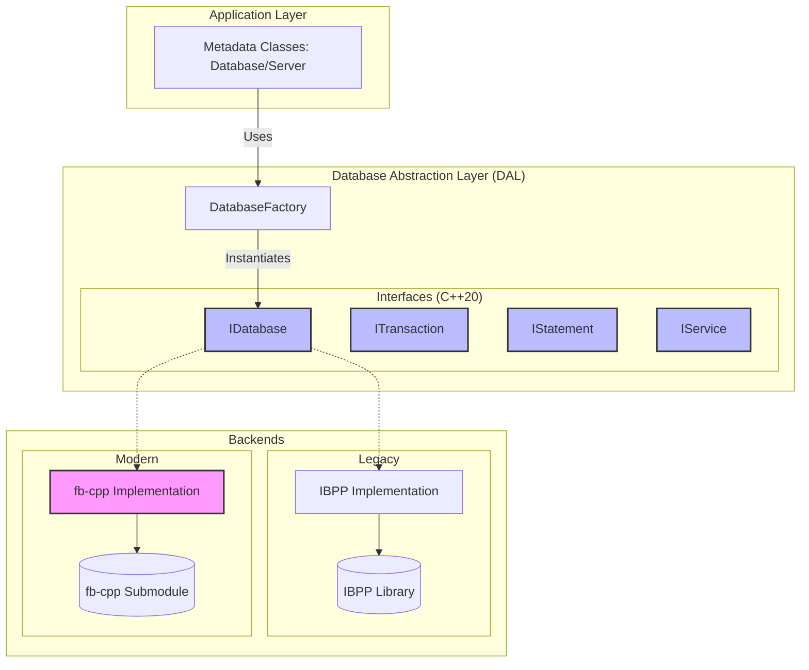

# Database Abstraction Layer (DAL) & fb-cpp Migration

This document describes the architectural changes introduced during the migration from the legacy IBPP library to the modern fb-cpp wrapper.

## Overview

The migration follows a "heart transplant" strategy, introducing a backend-agnostic abstraction layer that allows FlameRobin to support both the legacy IBPP library and the modern fb-cpp wrapper simultaneously during the transition.

### Architectural Diagram

## Migration Components

### Abstract Interfaces (`src/engine/db/`)
- **IDatabase**: Manages database connections and lifecycle.
- **ITransaction**: Handles transaction boundaries and isolation levels.
- **IStatement**: Encapsulates SQL preparation, execution, parameter binding, and result set fetching.
- **IService**: Provides access to Firebird services (backup, restore, maintenance).

### Database Factory
The `DatabaseFactory` class manages the instantiation of the appropriate backend based on configuration or runtime requirements.

### Backends
1.  **IBPP Backend**: A complete implementation of the DAL interfaces using the existing IBPP library, ensuring no regression during migration.
2.  **fb-cpp Backend**: A modern implementation leveraging C++20 and the latest Firebird API features.

## Discussion Summary (from PR #543)

- **Modernization**: The project has been upgraded to C++20 to support the new abstraction layer and the `fb-cpp` library.
- **Dependency Management**: `vcpkg` is now used for dependency management, including a custom registry for Firebird-related components.
- **Incremental Refactoring**: Metadata classes are being updated to hold pointers to DAL interfaces rather than direct IBPP objects, allowing for a gradual transition.
- **Build System**: CMake has been enhanced to handle cross-platform discovery of Firebird and wxWidgets via vcpkg.
